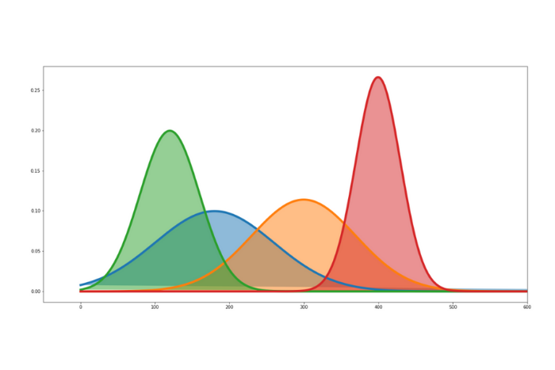

## Temario

* \| **Estadística I:** Inferencia estadística \| [Ir](index_stat1.md) \|

* \| **Estadística II:** Estadística no paramétrica y de regresión \| [Ir](index_stat2.md) \|

* \| **Estadística III:** Modelos de supervivencia y series de tiempo \| [Ir](index_stat3.md) \|

